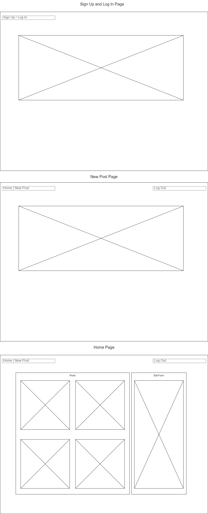
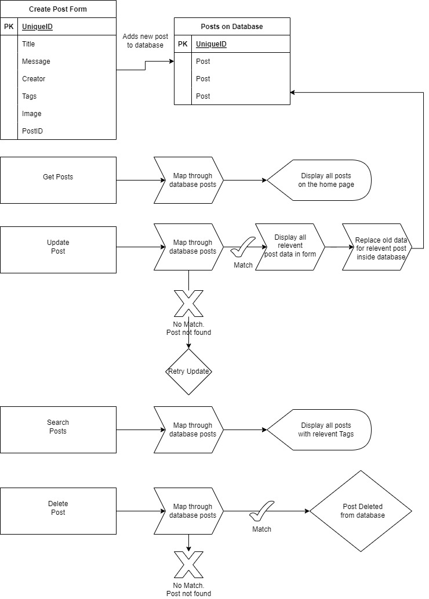

Description:  

I decided to make a simple logging app where users can write a brief description of an event, add a picture, and tags. I would like to further develop a search button and a detailed view of individual posts

Wireframes:

ERD:

Sign Up / Log In

Post Actions

Link to Render deploy: 
https://fullmernproject.onrender.com